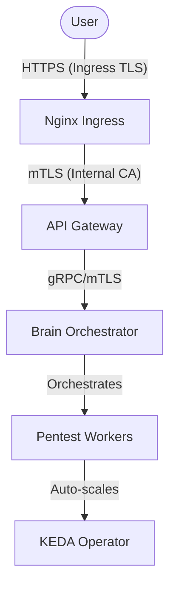

# ☁️ Aegis AI — Infrastructure (Aegis-AI-Infra)

**Project ID:** AEGIS-CORE-2026

> IaC (Infrastructure as Code) repository centralizing the entire Kubernetes topology of the **Aegis AI** platform. All resources are declarative and managed by **ArgoCD** via the **App of Apps** pattern.

---

## 📑 Table of Contents

- [Global Architecture](#🏗️-global-architecture)
- [Tech Stack](#🛠️-tech-stack)
- [Repository Structure](#📁-repository-structure)
- [Quick Start (Local)](#🚀-quick-start-local)
- [Available Environments](#🌍-available-environments)
- [Deployed Services](#📦-deployed-services)
- [Security & Zero Trust](#🔐-security--zero-trust)
- [Utility Scripts](#🔧-utility-scripts)
- [CI / Pre-commit](#🔄-ci--pre-commit)
- [Contributing](#🤝-contributing)

---

## 🏗️ Global Architecture

The Aegis infrastructure is built on an **Event-Driven Microservices** pattern on Kubernetes 1.28+. Continuous deployment is fully driven by **ArgoCD** (GitOps): any change merged to `HEAD` is automatically synchronized into the cluster.



---

## 🛠️ Tech Stack

| Component | Technology | Version |
|---|---|---|
| Orchestration | Kubernetes | 1.28+ |
| GitOps | ArgoCD | stable |
| **Autoscaling** | **KEDA** | **2.x** |
| **Cert Management** | **Cert-Manager** | **1.x** |
| Ingress | Nginx Ingress Controller | — |
| Workflow Engine | Temporal | 0.x (Helm) |
| Database | PostgreSQL | 16 (Bitnami) |
| Sandbox Runtime | gVisor (`runsc`) | `sandbox-*` namespaces |

---

## 📁 Repository Structure

```
Aegis-AI-Infra/
├── local-dev/                # Recommended Local Development Stack (Docker Compose)
├── kubernetes/
│   ├── bootstrap/
│   │   └── root-app-mvp.yaml         # ArgoCD Root App for MVP
│   │
│   ├── charts/
│   │   └── aegis-service/            # Universal Helm chart
│   │
│   └── envs/
│       └── mvp/                      # Minimum Viable Product (MVP)
│           ├── api-gateway/
│           ├── brain/
│           ├── infrastructure/
│           │   ├── cert-manager/     # Automated TLS/mTLS
│           │   ├── keda/             # Event-driven autoscaling
│           │   └── ...
│
└── scripts/
    ├── setup-env.sh                  # Bootstraps a full environment
    ├── generate-brain-certs.sh       # mTLS Certificate generation
    └── teardown-env.sh               # Local cluster cleanup
```

---

## 🚀 Quick Start (Local Development)

The easiest way to start developing on Aegis AI is using **Docker Compose**. This setup provides hot-reloading for the Gateway, Brain, and Dashboard.

### Recommended: Docker Compose

1. **Clone Repositories**: Ensure all microservices are in the same parent directory:
   ```text
   parent-directory/
   ├── Aegis-AI-Infra/
   ├── Aegis-AI-Brain/
   ├── Aegis-AI-Api-Gateway/
   └── Aegis-AI-Dashboard/
   ```

2. **Launch Stack**:
   ```bash
   cd Aegis-AI-Infra/local-dev
   cp .env.example .env
   docker compose up -d
   ```

For detailed instructions and credentials, see [local-dev/README.md](local-dev/README.md).

---

## 🏗️ Advanced Local Setup (Kubernetes)

If you need to test Kubernetes-specific features (ArgoCD, KEDA, mTLS), follow these steps:

### Prerequisites

- [Docker Desktop](https://www.docker.com/products/docker-desktop/) with Kubernetes enabled
- `kubectl` ≥ 1.28, `helm` ≥ 3.x
- `openssl` (for certificate generation)

### Launch the `mvp` environment

```bash
# 1. Run the full setup from root
./scripts/setup-env.sh mvp

# 2. Access the ArgoCD UI
kubectl port-forward svc/argocd-server -n argocd 8080:443
# → https://localhost:8080  (user: admin)
```

Retrieve the ArgoCD admin password:
```bash
kubectl -n argocd get secret argocd-initial-admin-secret \
  -o jsonpath="{.data.password}" | base64 -d && echo
```

---

## 🌍 Available Environments

| Environment | Branch | Namespace | Status |
|---|---|---|---|
| `mvp` | `main` | `aegis-system` | ✅ Active (Production-Ready) |

---

## 📦 Deployed Services

| Service | Image | Role | Networking |
|---|---|---|---|
| `api-gateway` | `ghcr.io/.../gateway` | User Entrypoint | Ingress + mTLS |
| `brain` | `ghcr.io/.../brain` | Orchestrator | gRPC mTLS Server |
| `worker-pentest`| `ghcr.io/.../worker` | Offensive Engine | KEDA Scaled |

---

## 🔐 Security & Zero Trust

Aegis enforces a **Zero Trust** security model:

1. **Mutual TLS (mTLS)**: All internal gRPC/HTTP traffic between microservices is encrypted and bi-directionally authenticated via a private Internal Root CA.
2. **Ingress TLS**: Automated SSL termination for edge traffic via **Cert-Manager**.
3. **Network Isolation**: Deny-all by default. Strict namespace segmentation and Cilium network policies.
4. **Runtime Security**: Untrusted workloads run exclusively on **gVisor (`runsc`)** sandboxes.

---

## 🔄 CI / Pre-commit

### Commit convention:
```
[TYPE] Message in English
```
Valid types: `ADD`, `FIX`, `UPDATE`, `REMOVE`, `DOC`, `REFACTOR`, `TEST`, `CI`, `CONFIG`, `MERGE`, `WORK`, `WIP`

---

*Aegis AI — Infrastructure Team — 2026*
