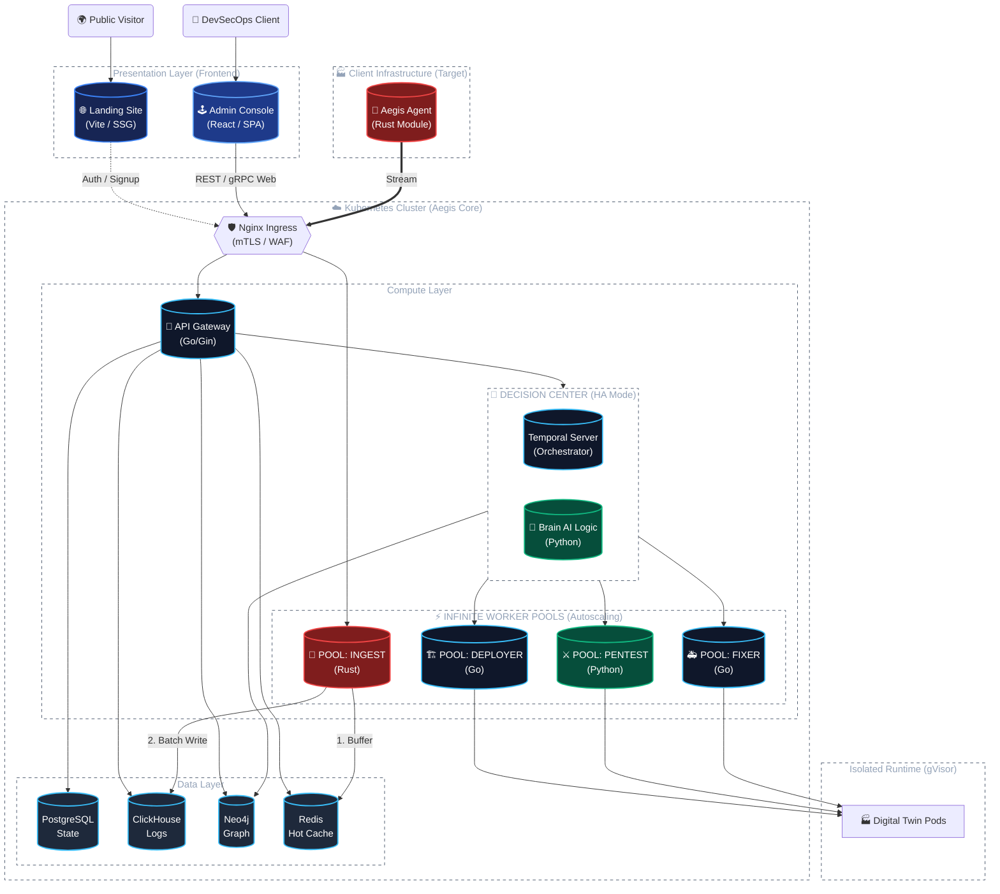

# Architecture — Aegis AI Platform

This document describes the **target architecture** of the Aegis AI platform — the full system design that the project aims to achieve by end of development.

---

## 🗺️ Full System Diagram



---

## 🏛️ Layers Overview

### Presentation Layer (Frontend)

| Service | Tech | Role |
|---|---|---|
| **Landing Site** | Vite / SSG | Public-facing marketing site. Handles auth/signup flows redirected to the API Gateway. |
| **Admin Console** | React / SPA | Internal DevSecOps dashboard. Full management interface communicating with the API Gateway via REST/gRPC-Web. |

---

### Client Infrastructure

| Service | Tech | Role |
|---|---|---|
| **Aegis Agent** | Rust | Lightweight module deployed **on the client's own infrastructure** (the target being analyzed). Streams telemetry data (network events, syscalls, process activity) to the Aegis cluster via a persistent authenticated stream. |

The Agent is the sole data collection point on the client side. It operates under a strictly minimal footprint and communicates exclusively with the cluster Ingress over mTLS.

---

### Kubernetes Cluster — Compute Layer

#### 🛡️ Nginx Ingress (mTLS / WAF)

Single entry point for all inbound traffic. Enforces:
- **mTLS** — mutual TLS client certificate authentication for the Agent stream
- **WAF** — web application firewall rules for HTTP traffic
- No internal service is reachable without going through the Ingress

#### 🐹 API Gateway (Go / Gin)

Central hub of the platform. Exposes the REST and gRPC-Web API consumed by the Admin Console and the Landing Site. Routes requests to:
- PostgreSQL (persistent state)
- ClickHouse (log queries)
- Neo4j (topology graph queries)
- Redis (hot cache reads)
- Brain Cluster (triggering analysis workflows)

#### 🧠 Decision Center — Brain + Temporal (HA Mode)

The cognitive core of Aegis:

| Component | Tech | Role |
|---|---|---|
| **Temporal Server** | Go | Durable workflow orchestrator. Schedules and tracks all long-running analysis and remediation workflows. Guarantees at-least-once execution. |
| **Brain AI Logic** | Python | Consumes topology data from Neo4j, applies AI/ML reasoning, and dispatches tasks to the Worker Pools via Temporal workflows. |

The Brain Cluster runs in **High Availability mode** — multiple replicas ensure no single point of failure in the decision pipeline.

#### ⚡ Worker Pools (Autoscaling)

All workers consume tasks from Temporal. Each pool scales independently based on queue depth.

| Pool | Tech | Role |
|---|---|---|
| **Ingest** | Rust | Receives the raw telemetry stream from the Agent. Buffers events into Redis (hot path) and batch-writes to ClickHouse (cold path). High-throughput, zero-copy pipeline. |
| **Deployer** | Go | Provisions and configures **Digital Twin** environments in the gVisor sandbox in response to Brain decisions. |
| **Pentest** | Python | Executes attack simulations against Digital Twin pods. Leverages offensive security tooling under controlled, sandboxed conditions. |
| **Fixer** | Go | Applies remediation actions based on Brain analysis — generates patches, configuration fixes, and hardening recommendations. |

---

### Data Layer

| Store | Tech | Role |
|---|---|---|
| **PostgreSQL** | PostgreSQL 16 | Primary relational store. Holds platform state: users, tenants, scan results, configurations. |
| **ClickHouse** | ClickHouse 23.8 | Columnar store for high-volume telemetry logs. Optimized for time-series analytical queries over agent-streamed events. |
| **Neo4j** | Neo4j 5.15 | Graph database storing the **topology map** of the client infrastructure — nodes, relationships, attack paths, blast radius. Core input to Brain reasoning. |
| **Redis** | Redis 7.2 | In-memory hot cache. Used by the Ingest worker as a real-time event buffer and by the API Gateway for low-latency reads. |

---

### Isolated Runtime — Digital Twin (gVisor)

Digital Twin pods run in dedicated `sandbox-*` namespaces under the **gVisor (`runsc`)** runtime. They represent a faithful replica of the client's infrastructure used as the attack target for the Pentest Worker.

Security guarantees:
- **gVisor** sandboxes all syscalls at the kernel level
- **Cilium deny-all** network policy — no ingress, no egress
- All interaction is mediated exclusively by the Worker Pools

See [gVisor Sandbox Runtime](gvisor-sandbox.md) for detailed configuration.

---

## 🔁 Key Data Flows

### 1. Agent Telemetry Ingestion
```
Aegis Agent (client infra)
  → [mTLS Stream] → Nginx Ingress
  → Ingest Worker (Rust)
  → Redis (real-time buffer) + ClickHouse (batch write)
```

### 2. DevSecOps Operation
```
Admin Console (React)
  → [REST/gRPC-Web] → Nginx Ingress → API Gateway (Go)
  → PostgreSQL / ClickHouse / Neo4j / Redis / Brain Cluster
```

### 3. AI Analysis & Attack Simulation
```
Brain (Python) reads Neo4j topology graph
  → Dispatches Temporal workflow
  → Deployer Worker spins up Digital Twin (gVisor sandbox)
  → Pentest Worker executes attack simulation against Twin
  → Fixer Worker generates remediation report
  → Results written to PostgreSQL + Neo4j
```

---

## 📖 Further Reading

- [Getting Started — Run locally](getting-started.md)
- [Kubernetes Deployment Patterns](kubernetes.md)
- [Cilium Network Policies](cilium-network.md)
- [gVisor Sandbox Runtime](gvisor-sandbox.md)
