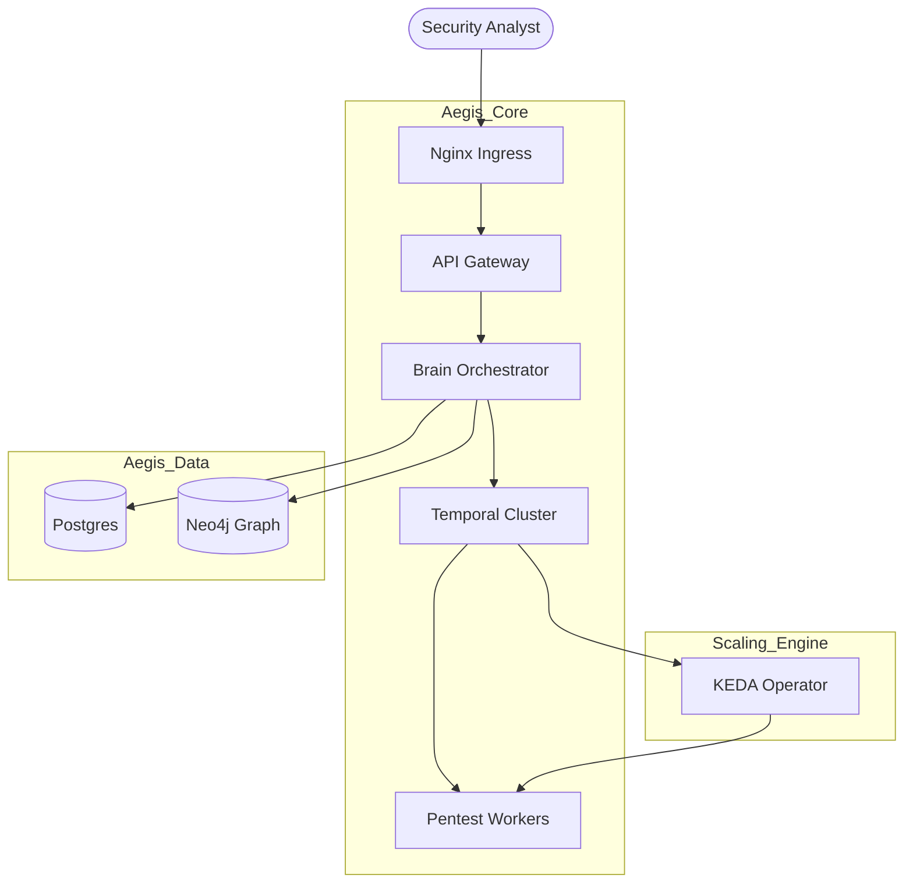

# 🏗️ Aegis AI Infrastructure: MVP Architecture

**Status:** Production (MVP)
**Cluster Orchestration:** Kubernetes 1.28+
**GitOps Engine:** ArgoCD (App-of-Apps)

This repository is the **Single Source of Truth** for the Aegis AI deployment. It translates declarative YAML manifests into a secured, high-intensity offensive cybersecurity platform.

---

## 🛰️ Platform Logic Flow

The Aegis platform is designed for **asynchronous scale**. Traffic enters via a hardened edge and is orchestrated by a central "Brain" that manages worker lifecycle via Temporal.

---

## 🔐 Zero Trust Network Topology

Aegis enforces a **Default-Deny** network posture using **Cilium Network Policies**:

### 1. Unified Identity (Internal mTLS)
No microservice trusts another based on IP. All internal communication is cryptographically verified using an internal Certificate Authority (CA) managed by **Cert-Manager**.

### 2. Micro-segmentation
- **Gateway Isolation**: The Gateway is prevented from reaching any database directly. All data access must go through the Brain's gRPC interface.
- **Data Confinement**: PostgreSQL and Neo4j only allow inbound connections from the `brain` service.
- **Sandbox Containment**: Vulnerable target containers are isolated in a restricted topology. They can reach the internet to fetch payloads but are strictly blocked from probe-scanning the internal cluster infrastructure.

---

## 🔄 Continuous Delivery (GitOps)

ArgoCD monitors the `main` branch of this repository. When a change is detected:
1. **Validation**: Kustomize renders the manifests for the `mvp` environment.
2. **Sync**: ArgoCD applies the diff to the cluster.
3. **Health Check**: Pods are rolled out and verified via Readiness/Liveness probes before the old version is terminated.

---

*Aegis AI Infrastructure Engineering — 2026*
