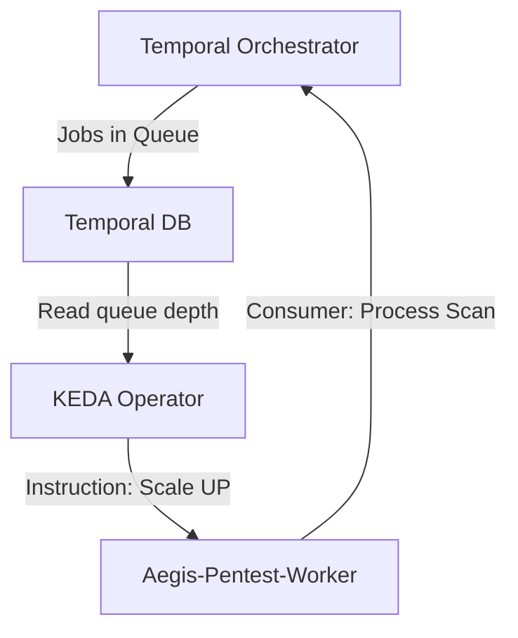

# 🌊 KEDA: Dynamic Worker Scaling & Cost Optimization

Aegis AI uses **KEDA (Kubernetes Event-Driven Autoscaling)** to manage the lifecycle of our **offensive security workers**. Unlike standard Kubernetes HPA (Horizontal Pod Autoscaler) which scales based on CPU/Memory, KEDA allows us to scale pods based on the actual number of **active jobs in the Temporal queue**.

---

## 🏗️ The Scaling Logic

KEDA monitors the platform's work queues and makes scaling decisions in real-time. This is crucial for **high-intensity offensive operations** where a single large scan might require dozens of parallel workers.

### Trigger Mechanism: Temporal Task Queues
KEDA polls the Temporal cluster's persistence layer (PostgreSQL) to check the depth of the task queues. If the queue size exceeds a threshold, KEDA instructs Kubernetes to spin up more worker pods.



---

## 🛠️ Key Benefits

### 1. Scale-to-Zero
When there are no active scans, Aegis scales the worker deployments down to **0 replicas**. This significantly reduces infrastructure costs in cloud environments (AWS/GCP) and frees up resources in local clusters.

### 2. Burstabillity
When a large scan target (e.g., a corporate IP range) is submitted, KEDA can rapidly scale the worker pool from 0 to 20+ replicas, processing the target with maximum concurrency.

### 3. Queue-Awareness
KEDA ensures that we only scale when there is **actual work to do**, preventing "ghost scaling" caused by background noise or idle memory consumption.

---

## ⚙️ Configuration (Helm)

KEDA is configured in the microservice `values.yaml` under the `keda` block:

```yaml
keda:
  enabled: true
  minReplicaCount: 0
  maxReplicaCount: 20
  pollingInterval: 15
  cooldownPeriod: 300
  triggers:
    - type: postgresql
      metadata:
        dbName: "temporal"
        tableName: "task_queues"
        userName: "temporal"
        passwordFromEnv: "TEMPORAL_DB_PASSWORD"
        host: "aegis-postgres-primary.aegis-system.svc.cluster.local"
        port: "5432"
        query: "SELECT count(*) FROM task_queues WHERE ...;"
        targetValue: "1"
```

---

## 🛡️ Validation & Monitoring

You can check the status of the auto-scaler using `kubectl`:

### 1. Check ScaledObjects
```bash
kubectl get scaledobjects -n aegis-system
```

### 2. Inspect Scaling History
```bash
kubectl describe scaledobject aegis-worker-pentest -n aegis-system
```

### 3. Monitor Pod Lifecycle
Watch as pods are created/terminated:
```bash
kubectl get pods -n aegis-system -l app=aegis-worker-pentest -w
```

---

*Aegis AI Cloud Engineering Team — 2026*
