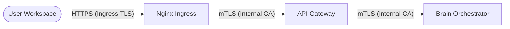

# 🔐 Zero Trust Infrastructure: mTLS & internal Security

Aegis AI implements a **Zero Trust** networking model within the Kubernetes cluster. This means no microservice implicitly trusts another purely based on its internal IP address. Every request between the **API Gateway** and the **Brain** (and eventually all sub-services) must be cryptographically authenticated via **mutual TLS (mTLS)**.

---

## 🏗️ The Dual-Path Trust Model

Aegis uses a layered security approach for traffic:

1. **Edge Security (Ingress TLS)**: Public traffic reaching our Nginx Ingress is secured using standard TLS certificates (managed by **Cert-Manager** with Let's Encrypt or corporate CAs).
2. **Internal Security (Service-to-Service mTLS)**: Internal gRPC traffic between services is encrypted and authenticated using a dedicated **Internal Root CA**.



---

## 🛠️ Key Components

### 1. Internal Root CA
The root of all trust for service-to-service communication. This CA is used to sign certificates for:
- **Server Identity**: Proves the Brain is really the Brain.
- **Client Identity**: Proves the Gateway is authorized to speak to the Brain.

### 2. Cert-Manager
Orchestrates the lifecycle of these internal certificates. It ensures that certificates are automatically rotated and that secrets are correctly injected into the microservice namespaces.

### 3. Envoy Sidecars (Future)
While current mTLS is handled at the application layer (Go/Python), future versions of Aegis will leverage **Cilium Service Mesh** or **Envoy** to handle this transparently.

---

## 🚦 Internal mTLS Flow

When the `API-Gateway` connects to the `Brain`:

1. **Server Hello**: The Brain presents its certificate signed by the Internal CA.
2. **Client Validation**: The Gateway verifies the Brain's certificate against the Internal CA root.
3. **Client Hello**: The Gateway presents its own certificate.
4. **Server Validation**: The Brain verifies the Gateway's certificate and checks the **Common Name (CN)** or **Subject Alternative Name (SAN)**.
5. **Secure Handshake**: A bi-directional encrypted tunnel is established.

---

## ⚙️ Configuration (Helm)

mTLS is enabled in the service `values.yaml` under the `tls` block:

```yaml
tls:
  enabled: true
  caCert: "/etc/tls/ca.crt"
  clientCert: "/etc/tls/client.crt"
  clientKey: "/etc/tls/client.key"
  serverName: "aegis-brain-mvp-frontend.aegis-system.svc.cluster.local"
```

---

## 🛡️ Validation & Troubleshooting

If you encounter `context deadline exceeded` or `transport: authentication handwriting failed`, follow these steps:

### 1. Verify Trust Roots
Ensure both pods have the correct `ca.crt` mounted.
```bash
kubectl exec -it <pod_name> -n aegis-system -- cat /etc/tls/ca.crt
```

### 2. Inspect Certificate Validity
Check the expiration and SANs of the generated secrets:
```bash
kubectl get secret brain-server-tls -n aegis-system -o jsonpath='{.data.tls\.crt}' | base64 -d | openssl x86 -text -noout
```

### 3. Log Inspection
Check the Gateway logs for `BRAIN_TLS_ENABLE=true` confirmation.

---

*Aegis AI Security Engineering Team — 2026*
