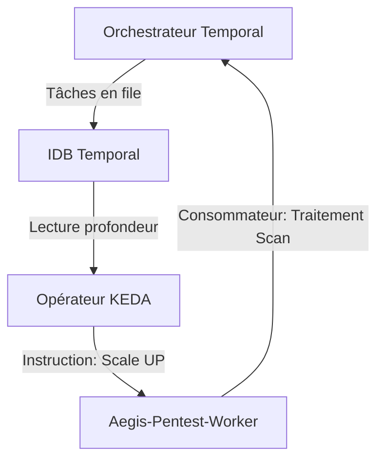

# 🌊 KEDA : Mise à l'Échelle Dynamique et Optimisation des Coûts

Aegis AI utilise **KEDA (Kubernetes Event-Driven Autoscaling)** pour gérer le cycle de vie de nos **workers de sécurité**. Contrairement à l'HPA (Horizontal Pod Autoscaler) standard qui se base sur le CPU/Mémoire, KEDA nous permet de mettre à l'échelle les pods en fonction du nombre réel de **tâches actives dans la file d'attente Temporal**.

---

## 🏗️ La Logique de Mise à l'Échelle

KEDA surveille les files d'attente de la plateforme et prend des décisions de mise à l'échelle en temps réel. C'est crucial pour les **opérations offensives à haute intensité** où un seul scan massif peut nécessiter des dizaines de workers en parallèle.

### Mécanisme de Déclenchement : Files d'Attente Temporal
KEDA interroge la couche de persistance du cluster Temporal (PostgreSQL) pour vérifier la profondeur des files d'attente de tâches. Si la taille de la file dépasse un seuil, KEDA instruit Kubernetes de lancer plus de pods de workers.



---

## 🛠️ Avantages Clés

### 1. Scale-to-Zero (Mise à l'échelle vers zéro)
Lorsqu'il n'y a pas de scan actif, Aegis réduit les déploiements de workers à **0 réplica**. Cela réduit considérablement les coûts d'infrastructure dans les environnements cloud (AWS/GCP) et libère des ressources dans les clusters locaux.

### 2. Capacité de Rafale (Burstabillity)
Lorsqu'une cible de scan importante (ex : plage IP d'une entreprise) est soumise, KEDA peut rapidement faire passer le pool de workers de 0 à plus de 20 réplicas, traitant la cible avec une concurrence maximale.

### 3. Conscience des Files d'Attente
KEDA garantit que nous ne mettons à l'échelle que lorsqu'il y a **un travail réel à faire**, évitant ainsi les "mises à l'échelle fantômes" causées par le bruit de fond ou la consommation de mémoire inactive.

---

## ⚙️ Configuration (Helm)

KEDA est configuré dans le fichier `values.yaml` du microservice sous le bloc `keda` :

```yaml
keda:
  enabled: true
  minReplicaCount: 0
  maxReplicaCount: 20
  pollingInterval: 15
  cooldownPeriod: 300
  triggers:
    - type: postgresql
      metadata:
        dbName: "temporal"
        tableName: "task_queues"
        userName: "temporal"
        passwordFromEnv: "TEMPORAL_DB_PASSWORD"
        host: "aegis-postgres-primary.aegis-system.svc.cluster.local"
        port: "5432"
        query: "SELECT count(*) FROM task_queues WHERE ...;"
        targetValue: "1"
```

---

## 🛡️ Validation et Surveillance

Vous pouvez vérifier l'état de l'auto-scaler à l'aide de `kubectl` :

### 1. Vérifier les ScaledObjects
```bash
kubectl get scaledobjects -n aegis-system
```

### 2. Inspecter l'Historique de Mise à l'Échelle
```bash
kubectl describe scaledobject aegis-worker-pentest -n aegis-system
```

### 3. Surveillance du Cycle de Vie des Pods
Observez la création/terminaison des pods :
```bash
kubectl get pods -n aegis-system -l app=aegis-worker-pentest -w
```

---

*Équipe Cloud Aegis AI — 2026*
