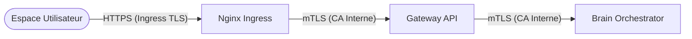

# 🔐 Infrastructure Zero Trust : mTLS et Sécurité Interne

Aegis AI implémente un modèle de réseau **Zero Trust** au sein du cluster Kubernetes. Cela signifie qu'aucun microservice ne fait implicitement confiance à un autre uniquement sur la base de son adresse IP interne. Chaque requête entre la **Gateway API** et le **Brain** (et à terme tous les sous-services) doit être authentifiée cryptographiquement via du **mutual TLS (mTLS)**.

---

## 🏗️ Le Modèle de Confiance à Double Voie

Aegis utilise une approche de sécurité multicouche pour le trafic :

1. **Sécurité en Bordure (Ingress TLS)** : Le trafic public atteignant notre Ingress Nginx est sécurisé par des certificats TLS standard (gérés par **Cert-Manager** avec Let's Encrypt ou des CA d'entreprise).
2. **Sécurité Interne (mTLS de Service à Service)** : Le trafic gRPC interne entre les services est chiffré et authentifié à l'aide d'une **CA Racine Interne** dédiée.



---

## 🛠️ Composants Clés

### 1. CA Racine Interne
La racine de toute confiance pour la communication de service à service. Cette CA est utilisée pour signer les certificats pour :
- **Identité du Serveur** : Prouve que le Brain est bien le Brain.
- **Identité du Client** : Prouve que la Gateway est autorisée à parler au Brain.

### 2. Cert-Manager
Orchestre le cycle de vie de ces certificats internes. Il garantit que les certificats sont automatiquement renouvelés et que les secrets sont correctement injectés dans les namespaces des microservices.

### 3. Sidecars Envoy (Futur)
Bien que le mTLS actuel soit géré au niveau de la couche applicative (Go/Python), les futures versions d'Aegis exploiteront **Cilium Service Mesh** ou **Envoy** pour gérer cela de manière transparente.

---

## 🚦 Flux mTLS Interne

Lorsque la `Gateway API` se connecte au `Brain` :

1. **Server Hello** : Le Brain présente son certificat signé par la CA Interne.
2. **Validation Client** : La Gateway vérifie le certificat du Brain par rapport à la racine de la CA Interne.
3. **Client Hello** : La Gateway présente son propre certificat.
4. **Validation Serveur** : Le Brain vérifie le certificat de la Gateway et contrôle le **Common Name (CN)** ou le **Subject Alternative Name (SAN)**.
5. **Handshake Sécurisé** : Un tunnel chiffré bidirectionnel est établi.

---

## ⚙️ Configuration (Helm)

Le mTLS est activé dans le fichier `values.yaml` du service sous le bloc `tls` :

```yaml
tls:
  enabled: true
  caCert: "/etc/tls/ca.crt"
  clientCert: "/etc/tls/client.crt"
  clientKey: "/etc/tls/client.key"
  serverName: "aegis-brain-mvp-frontend.aegis-system.svc.cluster.local"
```

---

## 🛡️ Validation et Dépannage

Si vous rencontrez une erreur `context deadline exceeded` ou `transport: authentication handwriting failed`, suivez ces étapes :

### 1. Vérifier les Racines de Confiance
Assurez-vous que les deux pods ont le bon `ca.crt` monté.
```bash
kubectl exec -it <nom_du_pod> -n aegis-system -- cat /etc/tls/ca.crt
```

### 2. Inspecter la Validité des Certificats
Vérifiez l'expiration et les SAN des secrets générés :
```bash
kubectl get secret brain-server-tls -n aegis-system -o jsonpath='{.data.tls\.crt}' | base64 -d | openssl x509 -text -noout
```

### 3. Inspection des Logs
Vérifiez les logs de la Gateway pour confirmer `BRAIN_TLS_ENABLE=true`.

---

*Équipe Ingénierie Sécurité Aegis AI — 2026*
