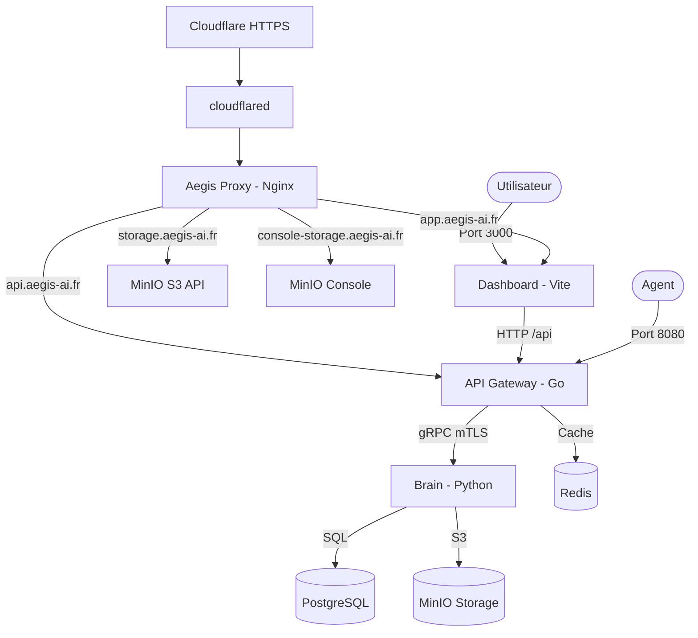

# Aegis AI - Local Development Environment 🐼🛡️

Ce répertoire contient la configuration pour lancer l'écosystème complet Aegis AI sur votre machine locale via Docker Compose.

## 🏗️ Architecture de Routage

L'environnement local expose le Dashboard en direct via Vite sur le port `3000` et l'API Gateway sur le port `8080`. Pour tester les domaines publics en HTTPS, tout passe par Cloudflare Tunnel, puis par le reverse proxy Nginx local qui route selon le hostname.



### Points d'entrée
- **Dashboard UI** : [http://localhost:3000](http://localhost:3000)
- **API Base URL** : [http://localhost:8080/api](http://localhost:8080/api)
- **Proxy optionnel** : [http://localhost](http://localhost)
- **Mailpit UI** : [http://localhost:8025](http://localhost:8025)
- **MinIO Console** : [http://localhost:9001](http://localhost:9001)
- **Temporal UI** : [http://localhost:8233](http://localhost:8233)
- **Neo4j Browser** : [http://localhost:7474](http://localhost:7474)
- **API publique via Cloudflare Tunnel** : [https://api.aegis-ai.fr/health](https://api.aegis-ai.fr/health)
- **Dashboard public via Cloudflare Tunnel** : [https://app.aegis-ai.fr](https://app.aegis-ai.fr)
- **MinIO S3 publique via Cloudflare Tunnel** : [https://storage.aegis-ai.fr](https://storage.aegis-ai.fr)
- **MinIO Console publique via Cloudflare Tunnel** : [https://console-storage.aegis-ai.fr](https://console-storage.aegis-ai.fr)

---

## 🚀 Démarrage Rapide

1.  **Configuration** : Copiez le fichier `.env.example` en `.env` et ajustez les secrets si nécessaire.
2.  **Certificats mTLS internes** :
    ```bash
    ./generate-mtls-certs.sh
    ```
    Les certificats locaux sont generes dans `local-dev/certs/`, ignores par Git et montes en lecture seule dans le Gateway et le Brain.
3.  **Lancement** :
    ```bash
    docker compose up -d
    ```
4.  **Verification** : Accedez a `http://localhost:3000` ou `https://app.aegis-ai.fr`. Vous devriez voir la page de connexion.

---

## Neo4j topology schema

Le service `neo4j-schema-init` applique avant `worker-ingest` les contraintes uniques sur les identifiants `Host`, `Container` et `Process`.

```bash
docker compose exec neo4j cypher-shell -u neo4j -p "${NEO4J_PASSWORD:-neo4j_password}" \
  "SHOW CONSTRAINTS YIELD name RETURN name ORDER BY name"
```

La verification de rejet d'un doublon peut etre executee dans une transaction, sans conserver de donnees de test :

```bash
docker compose exec neo4j cypher-shell -u neo4j -p "${NEO4J_PASSWORD:-neo4j_password}" \
  "CREATE (:Host {id: 'duplicate-check'}); CREATE (:Host {id: 'duplicate-check'});"
```

La seconde creation doit echouer avec une erreur de contrainte d'unicite.

---

## 🔐 Cloudflare Tunnel local

Le tunnel local utilise `TUNNEL_TOKEN` depuis `.env`. Dans Cloudflare Zero Trust, les public hostnames du tunnel doivent router vers le reverse proxy local :

- `app.aegis-ai.fr` -> `http://proxy:80` -> `dashboard:5173`
- `api.aegis-ai.fr` -> `http://proxy:80` -> `gateway:8080`
- `storage.aegis-ai.fr` -> `http://proxy:80` -> `minio:9000`
- `console-storage.aegis-ai.fr` -> `http://proxy:80` -> `minio:9001`

Le conteneur `cloudflared` démarre avec `docker compose up -d`. Si Cloudflare affiche une erreur 1033, vérifiez que le conteneur est bien actif :

```bash
docker compose ps cloudflared
docker compose logs -f cloudflared
curl -fsS https://api.aegis-ai.fr/health
```

Un seul environnement doit posséder les routes DNS Cloudflare actives pour `app.aegis-ai.fr`, `api.aegis-ai.fr` et `storage.aegis-ai.fr` à un instant donné : local-dev ou Kubernetes.

---

## 📨 Test du flow d'onboarding

Mailpit capture les emails d'invitation envoyés par le Brain en local.

1. Connectez-vous au Dashboard avec le compte seed :
   - Email : `admin@aegis-ai.com`
   - Mot de passe : `admin_password`
2. Depuis la page utilisateurs/entreprises, créez une nouvelle entreprise via le formulaire d'onboarding.
3. Ouvrez [http://localhost:8025](http://localhost:8025), puis ouvrez l'email reçu par l'owner.
4. Cliquez sur le lien `http://localhost:3000/setup-password?token=...`.
5. Définissez le mot de passe du owner.
6. Vérifiez que le token agent `ag_...` est affiché une seule fois après activation.
7. Confirmez l'accès au Dashboard avec le nouveau compte owner.

---

## 🤖 Guide de test des Agents

Les agents utilisent un **Deployment Token** pour s'authentifier. Voici comment tester le flux complet avec `curl`.

### 1. Enregistrement de l'Agent
Remplacez `TOKEN` par le token généré sur le Dashboard.
```bash
curl -X POST http://localhost:8080/api/agents/register \
  -H "Content-Type: application/json" \
  -d '{
    "token": "TOKEN_DE_DEPLOYMENT",
    "name": "Agent-Test-Local"
  }'
```
> Retourne un `agent_id` (ex: `dc91b2f3...`)

### 2. Mise à jour du Statut
L'authentification se fait via le header `Authorization: Bearer <TOKEN>`.
```bash
curl -X POST http://localhost:8080/api/agents/<AGENT_ID>/status \
  -H "Content-Type: application/json" \
  -H "Authorization: Bearer TOKEN_DE_DEPLOYMENT" \
  -d '{"status": "RUNNING"}'
```

### 3. Demande de lien d'Upload
```bash
curl -X GET "http://localhost:8080/api/agents/<AGENT_ID>/upload-url?filename=logs.zip" \
  -H "Authorization: Bearer TOKEN_DE_DEPLOYMENT"
```

---

## ⚡ Optimisations & Cache

### Vérification des Tokens (Redis)
Pour maximiser les performances, l'API Gateway met en cache les résultats de vérification des tokens de déploiement dans **Redis**.
- **TTL du cache** : 30 minutes.
- **Flux** : Si un agent envoie 1000 requêtes, seul le premier appel interroge le Brain (DB) ; les 999 suivants sont validés instantanément via Redis.

---

## 🛠️ Dépannage (Troubleshooting)

- **404 sur l'API** : Vérifiez que le conteneur `aegis-gateway` est bien lancé et que les routes ont le préfixe `/api`.
- **Erreur de connexion MinIO** : Si vous testez depuis l'hôte, ajoutez `127.0.0.1 minio` à votre fichier `/etc/hosts`.
- **Erreur mTLS Gateway/Brain** : Regenerez les certificats avec `./generate-mtls-certs.sh`, puis relancez `docker compose up -d --force-recreate brain gateway`.
- **Base de donnees vide** : Le Brain applique les migrations Alembic au demarrage. Si besoin, relancez le Brain : `docker compose restart brain`.

---
© 2026 Aegis AI. Tous droits réservés.
